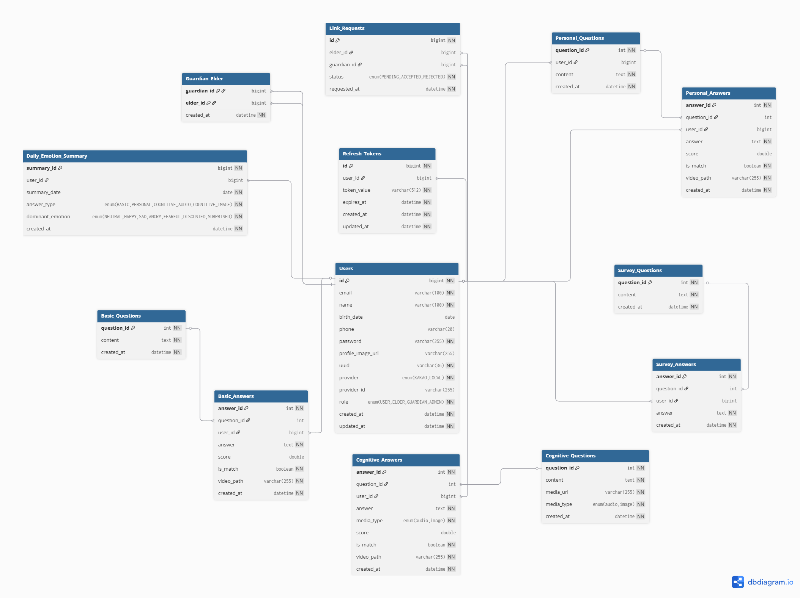
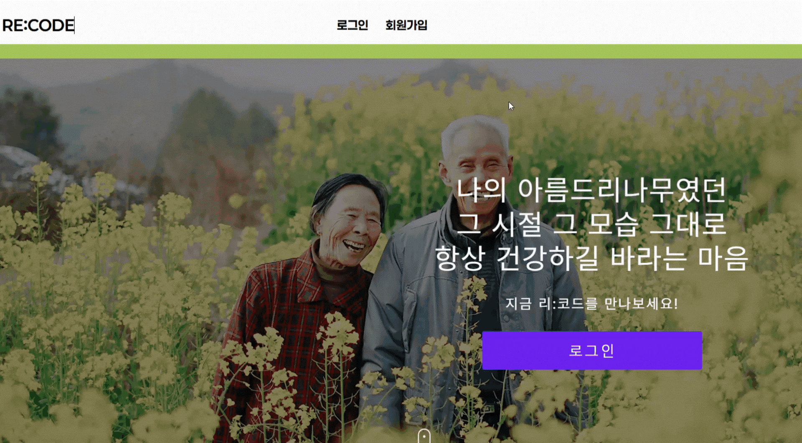
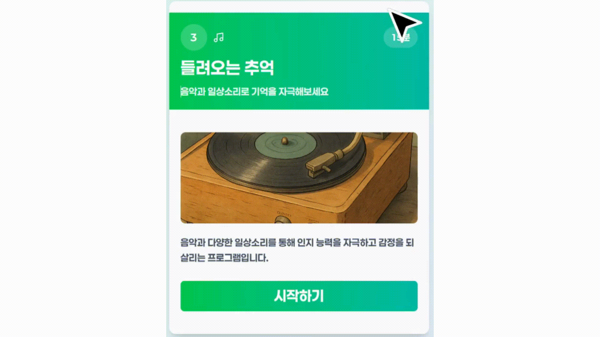

# README


# Re:code - 디지털 회상 훈련 플랫폼

## 📌 프로젝트 소개

**Re:code**는 고령자의 정서적 안정과 인지 능력 유지를 돕기 위한 **AI 기반 디지털 회상 훈련 플랫폼**입니다.

개인의 과거 경험을 떠올리게 하는 질문과 콘텐츠를 통해 고령자의 우울감을 완화하고 가족과의 정서적 교감을 강화합니다.

---

## 🎯 기획 배경

- 초고령 사회 진입에 따른 치매 예방 필요성 증가
- 오프라인 회상치료의 지속적인 관리 한계
- 고령층의 디지털 소외 해소 및 사회적 고립 해방

---

## 🎨 주요 기능

### 🔹 회상 훈련

- AI 기반 개인 맞춤형 질문 제공 (Gemini)
- STT로 응답 수집 + 감정 분석(face-api.js)
- 이미지/소리 기반 인지 자극 질문

### 🔹 보호자 연동

- 1회용 연동 토큰 기반 안전한 보호자 연결
- 회상 결과 열람 및 감정 캘린더 확인
- 중증 우울 알림 및 장기 미접속 알림 기능

### 🔹 AI 기반 분석

- GPT 기반 답변 적합도 평가
- 시각화로 성실도 피드백 제공

### 🔹 커뮤니티 기능 (2차 개발)

- 회상 영상 공유 및 댓글
- 관심사 기반 친구 추천
- 화상 커뮤니티

---

## 🧩 시스템 구성도 (ERD)



---

## ⚙️ 기술 스택

| 분류 | 기술 |
| --- | --- |
| 프론트엔드 | Next.JS, React, Typescript, Node.js / npm, Tailwind CSS, CSS Radix UI,  Lucide React, shadcn/ui , Framer Motion |
| 백엔드 | SpringBoot, Java 17, Gradle, JPA |
| AI | Gemini-flash (LLM), Naver Clova STT, face-api.js, gpt-4o-tts |
| 미디어 처리 | WebRTC |
| DB | MySQL |
| Infra | Jenkins,Nginx, AWS S3 |

## 🗂️ 기능 & API 명세 요약

### 🗂️ 기능 요약 

| 화면 | Epic | 기능 수 |
| --- | --- | --- |
| 회원가입/로그인/마이페이지 | 회원 관리 | 10+ |
| 회상 훈련 | 회상 훈련 | 20+ |
| 감정 캘린더 | 캘린더 | 6 |
| 보호자 연동 | 연동 관리 | 5 |

> 👉 총 40개 이상의 UI 기능 구현 (상세 기능: 기능 명세서 참조)

---

### 🔌 API 요약

#### ✅ 회원 & 인증 API
- `POST /api/v1/auth/register` – 회원가입  
- `POST /api/v1/auth/login` – 로그인  
- `POST /api/v1/auth/logout` – 로그아웃  
- `POST /api/v1/auth/reissue` – 토큰 재발급  
- `GET /api/v1/users/me` – 내 정보 조회  
- `PATCH /api/v1/users/me` – 내 정보 수정  
- `DELETE /api/v1/users/me` – 회원 탈퇴  

---

#### ✅ 회상 훈련 API
> 모든 질문/답변/감정은 `type` 쿼리로 구분  
> (`basic | cognitive | personal | survey`)

- `GET /api/v1/questions?type={type}` – 질문 조회  
- `POST /api/v1/questions/generate?type=personal` – 개인화 질문 생성  
- `POST /api/v1/answers?type={type}` – 답변 제출 및 평가  
- `POST /api/v1/emotions?type={type}` – 감정 기록 저장  
- `GET /api/v1/calendar` – 월간 회상 기록 조회  
- `GET /api/v1/calendar/{date}/videos` – 특정일 회상 영상 조회  
- `GET /api/v1/calendar/{date}/emotions` – 특정일 감정 기록/통계 조회  

---

#### ✅ 보호자 연동 API
- `POST /api/v1/links` – 연동 생성  
- `GET /api/v1/links` – 내 연동 목록  
- `GET /api/v1/links/guardians` – 보호자 목록 조회  
- `GET /api/v1/links/elders` – 노인 목록 조회  
- `DELETE /api/v1/links/{linkId}` – 연동 해제  

---

> 👉 전체 **확정된 API 20+ 개 제공** (요청/응답/에러코드 상세 명세 포함)


## 🚀 실행 방법

```bash

# 1. 백엔드 실행
cd backend
./gradlew bootRun

# 2. 프론트엔드 실행
cd frontend
npm install
npm run dev

```

> 음성 기능 정상 동작을 위해 HTTPS 환경 또는 localhost 환경 필요
> 

---

## 📺 미리보기

| 화면 | 미리보기(GIF) |
| --- | --- |
| 홈화면 |  |
| 일일설문 |  |
| 회상훈련 - 기초 |  |
| 회상훈련 - 개인화 |  |
| 회상훈련 - 인지(소리) |  |
| 회상훈련 - 인지(이미지) |  |
| 감정 캘린더 |  |


## 👨‍👩‍👧‍👦 팀 소개

| 이름 | 담당 |
| --- | --- |
| 김준수(팀장) | FE |
| 고준환 | FE |
| 김영민 | BE |
| 정지용 | BE,AI |
| 김혜정 | BE,Infra |

---

## 📌 향후 확장 계획

- 화상 회상 커뮤니티 기능 (WebRTC 기반)
- GPT 기반 반응형 보조 질문 시스템
- 일기/회상 자동 요약 기능
- 보호자 보고서 자동 생성
