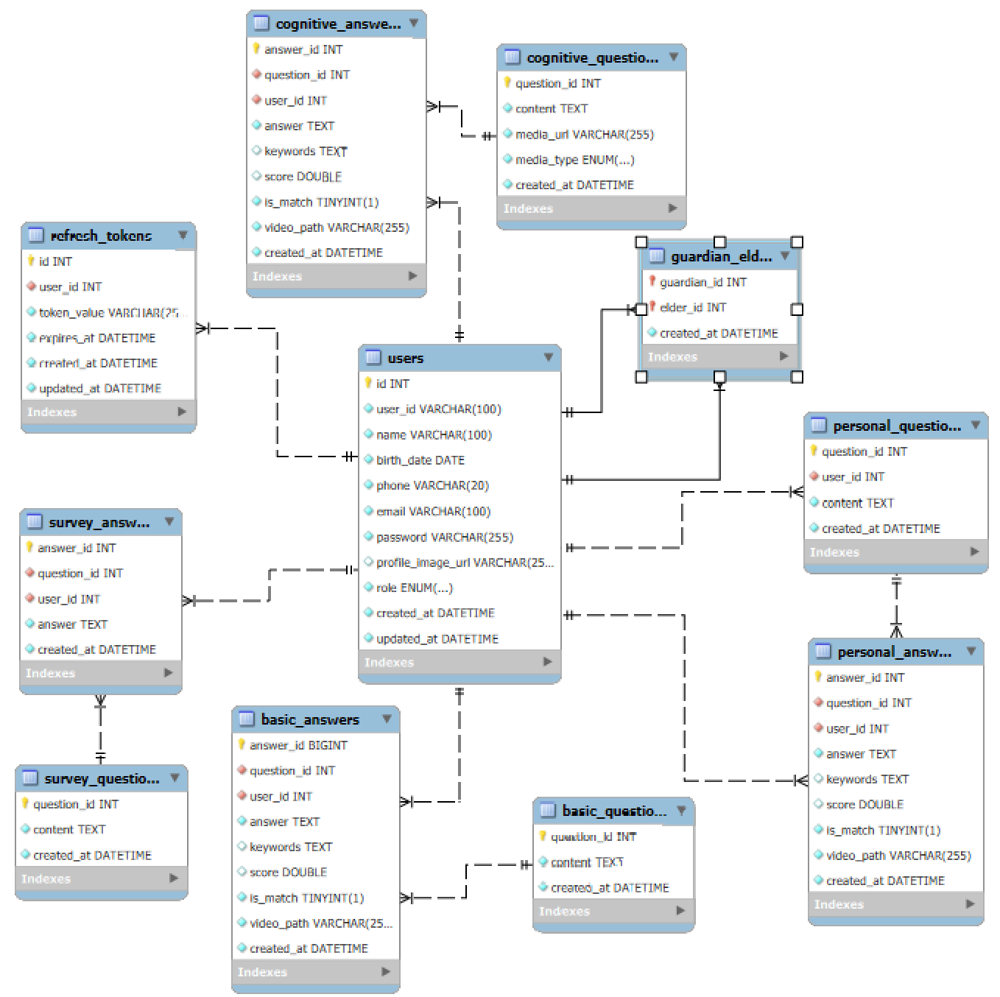

# README


# Re:code - 디지털 회상 치료 플랫폼

## 📌 프로젝트 소개

**Re:code**는 고령자의 정서적 안정과 인지 능력 유지를 돕기 위한 **AI 기반 디지털 회상 치료 플랫폼**입니다.

개인의 과거 경험을 떠올리게 하는 질문과 콘텐츠를 통해 고령자의 우울감을 완화하고 가족과의 정서적 교감을 강화합니다.

---

## 🎯 기획 배경

- 초고령 사회 진입에 따른 치매 예방 필요성 증가
- 오프라인 회상치료의 지속적인 관리 한계
- 고령층의 디지털 소외 해소 및 사회적 고립 해방

---

## 🎨 주요 기능

### 🔹 회상 훈련

- AI 기반 개인 맞춤형 질문 제공 (Gemini)
- STT로 응답 수집 + 감정 분석(face-api.js)
- 이미지/소리 기반 인지 자극 질문

### 🔹 보호자 연동

- 1회용 연동 토큰 기반 안전한 보호자 연결
- 회상 결과 열람 및 감정 캘린더 확인
- 중증 우울 알림 및 장기 미접속 알림 기능

### 🔹 AI 기반 분석

- GPT 기반 답변 적합도 평가
- 시각화로 성실도 피드백 제공

### 🔹 커뮤니티 기능 (2차 개발)

- 회상 영상 공유 및 댓글
- 관심사 기반 친구 추천
- 화상 커뮤니티

---

## 🧩 시스템 구성도 (ERD)



---

## ⚙️ 기술 스택

| 분류 | 기술 |
| --- | --- |
| 프론트엔드 | Next.JS, React, Typescript, Node.js / npm, Tailwind CSS, CSS Radix UI,  Lucide React, shadcn/ui , Framer Motion |
| 백엔드 | SpringBoot, Java 17, Gradle, JPA |
| AI | Gemini-flash (LLM), Naver Clova STT, face-api.js, gpt-4o-tts |
| 미디어 처리 | WebRTC |
| DB | MySQL |
| Infra | Jenkins,Nginx, AWS S3 |

---

## 🗂️ 기능 명세 요약

| 화면 | Epic | 기능 수 |
| --- | --- | --- |
| 회원가입/로그인/마이페이지 | 회원 관리 | 10+ |
| 회상 훈련 | 회상 훈련 | 20+ |
| 메인페이지/도우미 | 페이지 이동 | 10+ |
| 감정 캘린더 | 캘린더 | 6 |
| 커뮤니티 | 커뮤니티 | 6 |
| 알림 | 알림 | 2 |

> 👉 총 50개 이상의 UI 기능이 구현됨 (상세 기능: 기능 명세서 참조)
> 

---

## 🔌 API 명세 요약

### ✅ 회원 관련 API

- `/api/user/register` – 회원가입
- `/api/user/login` – 로그인
- `/api/user/logout` – 로그아웃
- `/api/user` – 내 정보 조회/수정

### ✅ 회상 훈련 관련 API

- `/api/questions/survey` – 설문 질문 조회
- `/api/questions/basic` – 기초 질문 조회
- `/api/questions/personal/generate` – 개인화 질문 생성
- `/api/calendar/records` – 회상 기록 조회
- `/api/calendar/emotion` – 감정 분석 통계 조회

### ✅ 커뮤니티 & 알림 API

- `/api/community/videos` – 회상 영상 피드
- `/api/community/videos/{videoId}/comments` – 댓글 작성
- `/api/alerts/severe-depression` – 중증 우울 알림
- `/api/alerts/inactivity` – 장기 미접속 리마인더

> 👉 전체 20+ API 제공 (요청/응답/에러코드 포함 상세 명세 있음)
> 

---

## 🚀 실행 방법

```bash

# 1. 백엔드 실행
cd backend
./gradlew bootRun

# 2. 프론트엔드 실행
cd frontend
npm install
npm run dev

```

> 음성 기능 정상 동작을 위해 HTTPS 환경 또는 localhost 환경 필요
> 

---

## 👨‍👩‍👧‍👦 팀 소개

| 이름 | 담당 |
| --- | --- |
| 김준수(팀장) | FE |
| 고준환 | FE |
| 김영민 | BE |
| 정지용 | BE,AI |
| 김혜정 | BE,Infra |

---

## 📌 향후 확장 계획

- 화상 회상 커뮤니티 기능 (WebRTC 기반)
- GPT 기반 반응형 보조 질문 시스템
- 일기/회상 자동 요약 기능
- 보호자 보고서 자동 생성